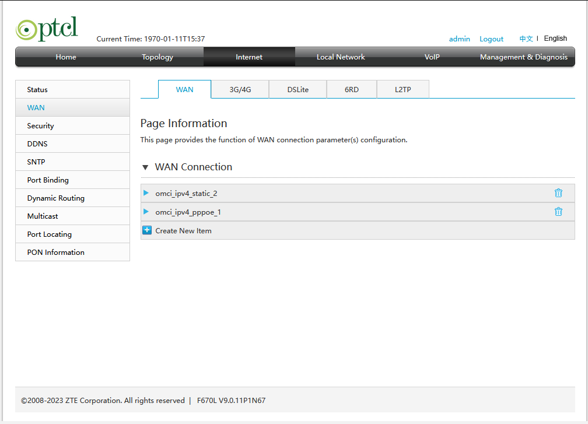
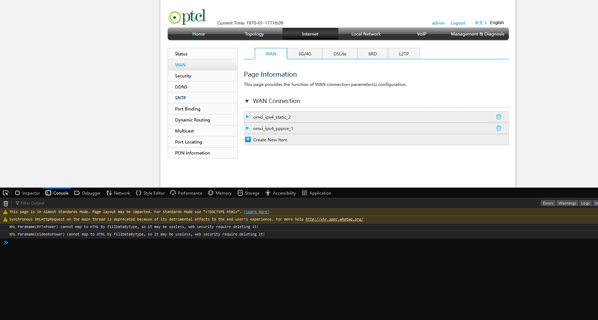
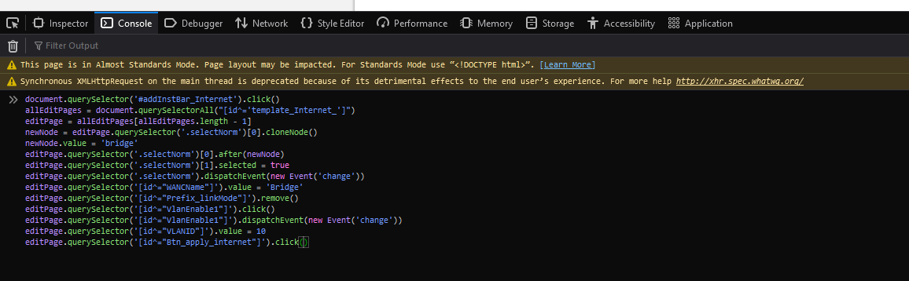
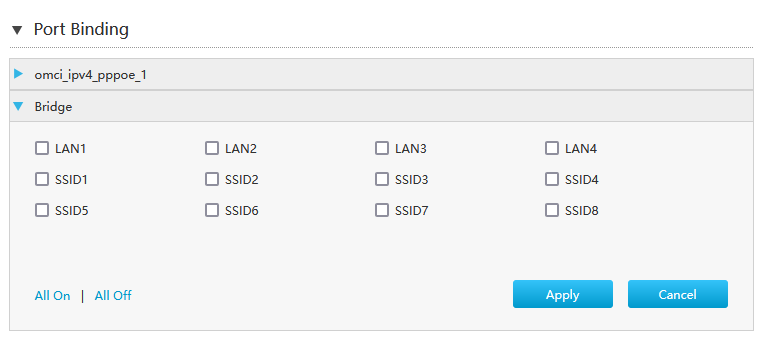
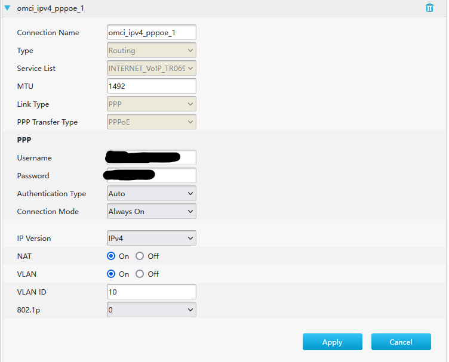

# How to Bridge PTCL F670L Fiber Modem

**Note: This is only tested on F670L V9.0.11P1N67. If you have a different version, these steps may not work.**

## Login to Modem

1.  Default IP for modem’s web page should be: `192.168.0.1`
2.  Use default credentials:
    -   Username: admin
    -   Password: The last 8 digits of your modem’s MAC address (in uppercase). You can find the MAC address on the back of your modem, e.g., MAC = 66:55:E3:5G:6J:GH, Password = E35G6JGH

## Configure WAN Settings

1.  Go to **Internet > WAN**. 
2.  Open browser console:
    -   Firefox: `CTRL + SHIFT + K`
    -   Chrome: `CTRL + SHIFT + J` 
3.  Paste the following JavaScript code into the console and press Enter:

```javascript
document.querySelector('#addInstBar_Internet').click()
allEditPages = document.querySelectorAll("[id^='template_Internet_']")
editPage = allEditPages[allEditPages.length - 1]
newNode = editPage.querySelector('.selectNorm')[0].cloneNode()
newNode.value = 'bridge'
editPage.querySelector('.selectNorm')[0].after(newNode)
editPage.querySelector('.selectNorm')[1].selected = true
editPage.querySelector('.selectNorm').dispatchEvent(new Event('change'))
editPage.querySelector('[id^="WANCName"]').value = 'Bridge'
editPage.querySelector('[id^="Prefix_linkMode"]').remove()
editPage.querySelector('[id^="VlanEnable1"]').click()
editPage.querySelector('[id^="VlanEnable1"]').dispatchEvent(new Event('change'))
editPage.querySelector('[id^="VLANID"]').value = 10
editPage.querySelector('[id^="Btn_apply_internet"]').click()
```



If you see the message “Your data have been stored,” the configuration was successful 

## Port Binding

1.  Go to **Internet > Port Binding**.
2.  Select “Bridge” from the drop-down menu. 
3.  Check **LAN4** and click **Apply**.

## Disable VLAN for PPPoE Configuration

1.  Go to **Internet > WAN**.
2.  Expand the “omci\_ipv4\_pppoe\_1” drop-down. 
3.  Set **VLAN** to **off** and click **Apply**. (Your internet will stop working at this point)

## Connect to Router

1.  Connect the modem’s **LAN Port 4** to the router’s **WAN port**.
2.  Set up **PPPoE** on your router (password is usually “ptcl”).
