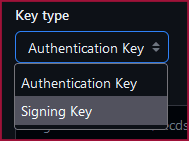

# Github SSH Login

First generate a ssh key

```bash
ssh-keygen -t ed25519 -C "your_email@example.com"
```

<details>
<summary>What if i added passphrase to my SSH key?</summary>

Start ssh-agent and register key

```bash
eval "$(ssh-agent -s)"
ssh-add ~/.ssh/id_ed25519
```

This will keep the key in memory until next reboot/session so you can use the key without password until next reboot/session

</details>

<details>
<summary>What if i didn't keep the default "id_ed25519" name?</summary>

You can configure SSH to use other keys from “~/.ssh/config” file

```bash
# Create file if doesn't exist already
cd ~/.ssh
touch config
sudo chmod 644 config

# Open file in editor
nano config
```

and then add this in the file

```
Host github.com
        IdentityFile ~/.ssh/<keyname>
```

</details>

Copy the public key and add it on [Github](https://github.com/settings/ssh/)

```bash
cat ~/.ssh/id_ed25519.pub
```

Thats it! You are now authenticated on GitHub using your SSH key.

## GitHub Commit Signing Using SSH

To use the same SSH key for signing commits on GitHub you need to re-add the key on [Github](https://github.com/settings/ssh/) but this time change “Key type” to “Signing Key”  and then run

```bash
git config --global gpg.format ssh
git config --global user.signingkey ~/.ssh/id_ed25519
```

and now you can use -S to sign commit

```bash
git commit -m "misc changes" -S
```

or you can setup auto signing

```bash
git config --global commit.gpgsign true
```

-   [Source 1](https://docs.github.com/en/authentication/connecting-to-github-with-ssh/generating-a-new-ssh-key-and-adding-it-to-the-ssh-agent)
-   [Source 2](https://docs.github.com/en/authentication/managing-commit-signature-verification/telling-git-about-your-signing-key)
-   [Source 3](https://docs.github.com/en/authentication/managing-commit-signature-verification/signing-commits)
-   [Source 4](https://linuxize.com/post/using-the-ssh-config-file/#shared-ssh-config-file-example)
